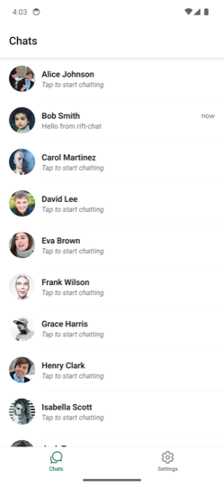
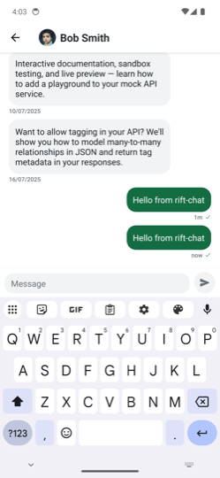
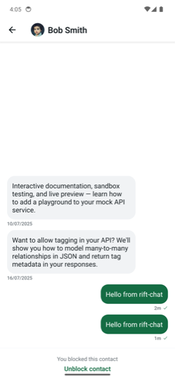
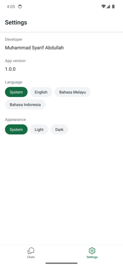
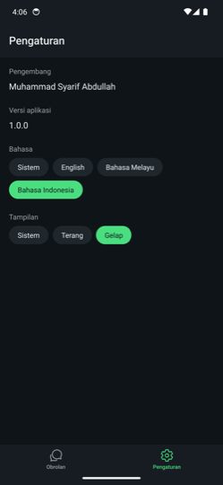

# Rift Chat

A React Native chat client built with Expo, TanStack Query and Zustand, over the public
[responserift.dev](https://responserift.dev) API — where `api/users` are contacts and
`api/posts` are messages.

> **Status.** 68 of 70 tasks in the [delivery plan](./plans/rift-chat-mvp/delivery.md) are
> complete, verified on an Android emulator. The release APK, the demo recording and the
> screenshots are all committed; only closing the plan and submitting remain — see
> [What's left](#whats-left). Nothing in this README claims work that has not been done.

**[Download the APK](./release/rift-chat-v1.0.0.apk)** · 67 MB · SHA-256
`5a32d7d3e44fedf2a7bf9d870ca81ad2b18c912bd6061db54bca084f55015869`

Signed with a debug keystore — a review artifact, not a distributable build. Packaged for
`arm64-v8a` and `x86_64`, which covers physical devices and the emulators reviewers use; a
four-ABI build comes out at 106 MB and GitHub rejects files over 100 MB.

## Demo

<p align="center">
  
</p>

Sending a message, then going back to the list — the row previews what was just sent, marked
**now**. The server stored none of it; the outbox did.

The screenshots below are the same build running against the live API on an Android emulator.

|                                                                                        Chats                                                                                        |                                                                          Chat                                                                           |                                                   Profile                                                   |
| :---------------------------------------------------------------------------------------------------------------------------------------------------------------------------------: | :-----------------------------------------------------------------------------------------------------------------------------------------------------: | :---------------------------------------------------------------------------------------------------------: |
|  |  |  |

|                                                                             Blocked                                                                              |                                                            Settings                                                            |                                              Dark mode + Indonesian                                              |
| :--------------------------------------------------------------------------------------------------------------------------------------------------------------: | :----------------------------------------------------------------------------------------------------------------------------: | :--------------------------------------------------------------------------------------------------------------: |
|  |  |  |

## Quick start

```bash
npm install
npm run android      # or: npm run ios — prebuild runs automatically
```

Expo Go will not work: MMKV and Reanimated need native code, so this is a development build.
Full walkthrough: [Tutorial: Getting started](./docs/tutorials/getting-started.md).

## The interesting part

**`POST /api/posts` returns `201` and does not persist anything**, and the `id` it returns is
always `101`. `GET /api/posts?userId=5` returns three posts, all authored _by_ the contact —
there is no sender field, so nothing in the API can represent a message the user wrote.

I found this by probing the API before writing any code, and it decided the architecture. A
conversation cannot be a projection of server state, because the outgoing half has nowhere on the
server to live. So a thread is the union of two sources, merged at read time:

```text
messages(contactId) = server posts (incoming)  ∪  outbox messages (outgoing)
                      ordered by createdAt
```

The consequence that matters: **a successful send must never invalidate the thread query** —
invalidating would refetch the contact's original posts and delete every message the user had
ever sent, as the direct result of a _successful_ send. Two things follow: a failed send is
**not** rolled back (that would delete what the user typed — it stays visible, marked failed, with
tap-to-retry), and the response `id` is discarded (always `101`, so neither unique nor stable).

This is what real messaging clients do: compose locally, persist immediately, reconcile when the
network allows. Full reasoning in [Message model](./docs/explanation/message-model.md) and
[ADR 0004](./docs/explanation/adr/0004-message-model-and-outbox.md).

## Project structure

Feature slices over a shared core, with a one-way dependency direction — `app → features → core`.
Slices never import each other; shared code moves down into `core/`.

```text
src/
├── app/                  # expo-router routes — thin; no data fetching, no logic
│   ├── (tabs)/           #   Chats · Settings
│   ├── chat/[id].tsx
│   └── profile/[id].tsx
├── core/                 # cross-cutting only; imports nothing from features/
│   ├── api/              #   BaseHttpClient (axios) · RiftApi · wire types
│   ├── store/            #   Zustand store + MMKV persistence
│   ├── query-keys/       #   the single query-key factory
│   ├── network/          #   NetInfo → React Query's onlineManager
│   ├── theme/            #   design tokens, light/dark palettes
│   ├── i18n/             #   i18next + en/ms/id catalogs
│   ├── format/           #   relative time
│   └── ui/               #   Avatar · Button · Screen · Skeleton/Empty/Error · OfflineBanner
└── features/
    ├── chats/    { api, model, ui }
    ├── chat/     { api, ui }
    ├── profile/  { api, ui }
    └── settings/ { ui }
```

Within a slice, `api/` holds query and mutation hooks, `model/` holds pure business logic, and
`ui/` holds screens and components. Details:
[Project structure](./docs/reference/project-structure.md).

## Architecture highlights

| Element                                     | In one line                                                                                                                                                                                                     |
| ------------------------------------------- | --------------------------------------------------------------------------------------------------------------------------------------------------------------------------------------------------------------- |
| **The state boundary**                      | React Query owns what the server knows; Zustand + MMKV own what only this device knows — which, because the API persists nothing, is everything the user authors. [→](./docs/reference/query-keys-and-state.md) |
| **One API surface**                         | Every call — query, infinite query and mutation — goes through `RiftApi extends BaseHttpClient`. No feature file imports axios or builds a URL. [→](./docs/explanation/architecture.md)                         |
| **Architecture proportional to complexity** | Exactly one slice has a domain layer, because exactly one has real rules. `Result<T, E>`, ports and barrel files were considered and cut. [→](./docs/explanation/architecture.md)                               |
| **Arithmetic pagination**                   | Both collections report `total`, so the infinite-scroll stop condition is `offset + limit >= total`, not a guess. [→](./docs/reference/api-contract.md)                                                         |
| **Tokens, not values**                      | No hardcoded colour, spacing or string anywhere — dark mode and three locales work by construction. [→](./docs/reference/design-tokens.md)                                                                      |

## Technical decisions

Each record states the context, lays the alternatives side by side with their trade-offs, and
names the condition that would change the answer.

| #                                                               | Decision           | Outcome                                                                                       |
| --------------------------------------------------------------- | ------------------ | --------------------------------------------------------------------------------------------- |
| [0001](./docs/explanation/adr/0001-state-management-zustand.md) | Client state       | **Zustand** over Redux Toolkit and Jotai                                                      |
| [0002](./docs/explanation/adr/0002-storage-mmkv.md)             | Persistence        | **MMKV** over AsyncStorage — synchronous reads mean no flash of an empty thread on cold start |
| [0003](./docs/explanation/adr/0003-list-rendering-flatlist.md)  | List rendering     | **FlatList, tuned** over FlashList — 60 rows paged 20 at a time does not need a recycler      |
| [0004](./docs/explanation/adr/0004-message-model-and-outbox.md) | Conversation model | **Persisted outbox merged at read time** over two fabricated-data alternatives                |

ADR 0003 is the one I would most expect to be challenged. Reaching for FlashList would have
signalled "performance work" without evidence; at 60 rows paged 20 at a time, a tuned FlatList is
sufficient and adds no dependency.

## Testing

**153 tests, 89% statements / 82% branches**, with the coverage threshold set just
under what the suite reaches so a regression trips it. Unit tests cover the outbox merge and
status lifecycle, integration tests cover the send lifecycle and pagination, and one Maestro flow
covers navigation, the real keyboard and persistence across a process restart.

Tests mock the **transport** (axios), never the hooks — so the real API class, React Query cache,
retry and mutation lifecycle are all exercised. Fixtures reproduce the API's quirks: the `POST`
fixture returns `id: 101` and the collection is unchanged afterwards. A fixture that pretended the
write persisted would hide the bug the app is designed around.

The test that matters most asserts a **negative**: sending triggers no thread refetch, and ten
consecutive sends leave ten distinct messages. That is the one bug that would silently destroy
user data while demoing perfectly. Reasoning and what was deliberately left untested:
[Testing strategy](./docs/explanation/testing-strategy.md).

## How AI aided development

This project was built with Claude Code, and the evidence is committed rather than described:
[`.claude/`](./.claude) holds 9 agents and 13 skills, and
[`plans/rift-chat-mvp/`](./plans/rift-chat-mvp) holds the requirements, technical design and a
70-task delivery checklist. The commit history shows the sequence.

**What the AI did that mattered.** It probed the live API before any code was written and found
that `POST` does not persist and always returns `id: 101` — the fact the entire architecture turns
on, and one I would not have discovered until much later from the brief alone. It then ran a
structured design interrogation (~20 decisions, each with alternatives and trade-offs) _before_
implementation, and wrote the Diátaxis docs and ADRs.

**What I decided.** Every architectural fork, including several where I overruled it:

- It proposed **FlashList**; I rejected it as unmeasured over-engineering at 60 rows. It agreed
  the reasoning was sound and wrote ADR 0003 around the measured position instead.
- It proposed **seeded placeholder messages** to make the Chats list look populated; I rejected
  fabricating data the API does not have. The honest empty state is the result.
- It proposed `Result<T, Failure>`, ports, and barrel files; I cut all three as abstractions
  nobody asked for.

**Where it was wrong, and how that was caught.** Twice it documented things confidently that
turned out to be false, and both were caught by _running_ rather than reading: it claimed
`react-native-mmkv` ships a Jest mock (v4 is a Nitro module and cannot load under Jest at all),
and it claimed Hermes ships full `Intl` (`Intl.RelativeTimeFormat` is **undefined** on device —
Node implements it, so every unit test passed while the app crashed with a red box).

That second one is the clearest lesson from this build: a green test suite is not evidence that an
app runs. Four bugs reached a working device despite full test coverage, and each was found by
driving the real app and reading a screenshot.

## Documentation

Organised with [Diátaxis](https://diataxis.fr/) — index at [`docs/`](./docs/README.md).

- **Understanding** → [Architecture](./docs/explanation/architecture.md) ·
  [Message model](./docs/explanation/message-model.md) ·
  [Decision records](./docs/explanation/adr/README.md)
- **Looking up** → [API contract](./docs/reference/api-contract.md) (the real probed shapes) ·
  [Conventions](./docs/reference/conventions.md) ·
  [Project structure](./docs/reference/project-structure.md)
- **Doing** → [Add a feature](./docs/how-to/add-a-feature.md) ·
  [Run and test](./docs/how-to/run-and-test.md)

## What's left

Named so their absence reads as a plan rather than an omission:

| Item                            | Status                                                      |
| ------------------------------- | ----------------------------------------------------------- |
| Tick the plan closed            | T-10.8                                                      |
| Push and share the link         | T-10.9                                                      |
| **Scope cut at the day-3 line** | **None.** All four P2 tasks landed, so nothing was dropped. |

## Tech stack

Expo SDK 57 · React Native 0.86.3 · React 19.2.3 · TypeScript 6 (strict) · expo-router ·
TanStack Query 5 · Zustand 5 · MMKV 4 · axios · i18next (en/ms/id) · Jest + React Native
Testing Library · Maestro.

Versions are pinned to Expo's SDK manifest, not npm's `latest` — for a managed Expo project those
differ, and `react-native-gesture-handler` is a whole major version apart. Details and the version
traps that cost real time: [Tech stack](./docs/reference/tech-stack.md).

## Licence

[MIT](./LICENSE) © Muhammad Syarif Abdullah
